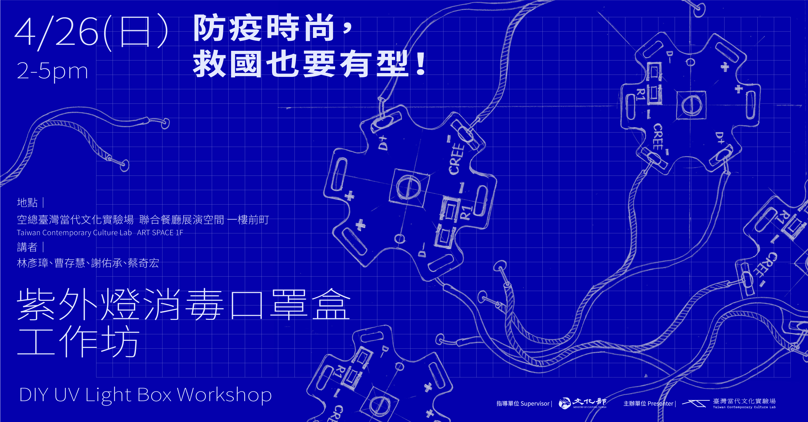

# 紫外燈消毒口罩盒

## 計畫說明

[空總臺灣當代文化實驗場 C-LAB](https://www.facebook.com/TCCLAB.ORG) 的重點發展方向之一為發展科技媒體，建立科技媒體實驗群(Cluster of Experimental Technology Media, CETM)。著重於實驗創新與社會鏈結，因此成立各類項科技媒體實驗室，以跨域、共創、協作方式，打造文化與科技的實驗平台。

全球因 COVID-19 疫情持續升溫，全球防疫物資掀起搶購亂象，為發揮實驗自造者 Maker 精神，C-LAB 將舉辦系列 DIY 講座活動，推出防疫二部曲：自製Micro:bit額溫槍及紫外燈消毒口罩工作坊，由背景來自生物醫學、電子工程、科技藝術家、建築等講師共同主動發起參與，以藝術行動主義支持防疫，一起捲起袖子，透過知識原理分享及實作，帶領大家認識紫外線消毒原理與實際效果，並動手自製 Micro:bit 額溫槍。科技藝術結合時尚，讓你救國更有感！ 

關於工作坊活動緣起及詳細說明，請看《[防疫時尚，救國也要有型！ 紫外燈消毒口罩盒工作坊](https://www.facebook.com/events/219780425920506/)》活動說明專頁。

## 關於這個 Repository

你可以在這個 github repo 裡面找到所有關於「自製紫外燈消毒口罩盒」所需的資訊。包含設備清單、組裝說明、外殼設計，以及它們相關的說明文件。甚至如果你想用這裡的資料去開設一個工作坊推廣，我們也樂見這樣的事情發生。  

[C-LAB](https://www.facebook.com/TCCLAB.ORG) 秉持開放文化自由分享精神，本次工作坊的文字、影像、設計、程式碼採用「公眾領域貢獻宣告」（CC0）釋出供公眾自由使用。

* docs -- 工作坊投影片、組裝說明書
* video -- 活動相關影片
* visual-design -- 視覺設計

