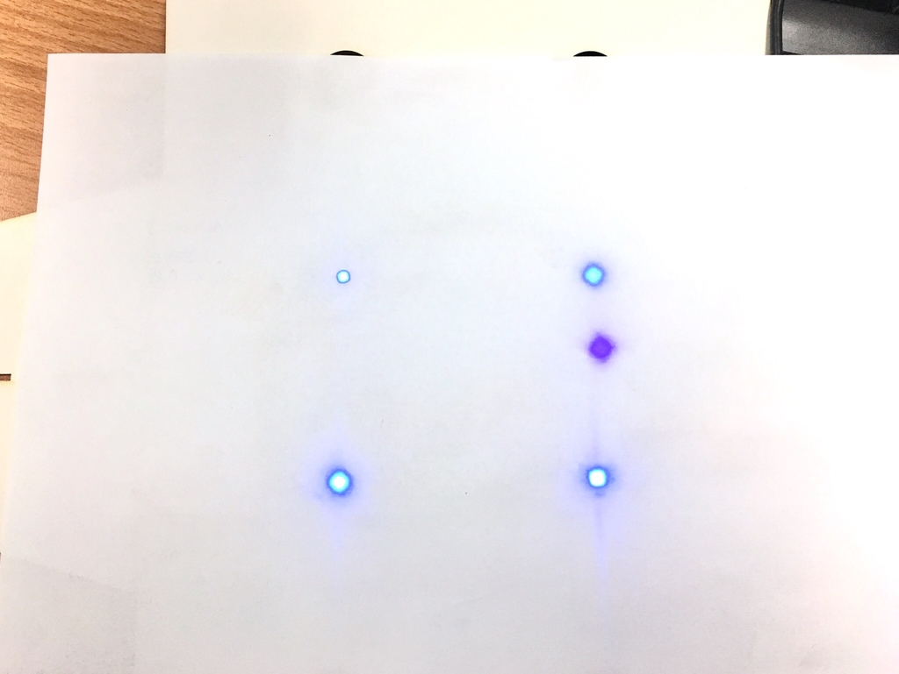

# 小技巧: 調整 UVC LED 亮度

在連接 UVC 燈條的時候，一般會使用的並聯方式是一個燈板接著下一個燈板，如下圖所示。

但實際測試的時候會發現，亮度會隨著並接的個數增加而漸漸遞減，你可以墊一張 A4 紙張觀察它的亮度。原因是每經過一個燈板便會產生壓降。

註：千萬不要直視 UVC 光源。以下的測試方式也不宜目視過久。

調整的方式如下圖所示：從升壓板出來的 VCC (正極)分別接到各個登板的正極；GND (負極)則分別接到各個登板的負極。

測試結果如下。

事實上這兩種接法在電路 "邏輯上是等效的"，第一種方法 (工作坊的做法) 佈線較容易，這裡提的第二種方法可以讓你有較均勻的亮度。

~ END ~